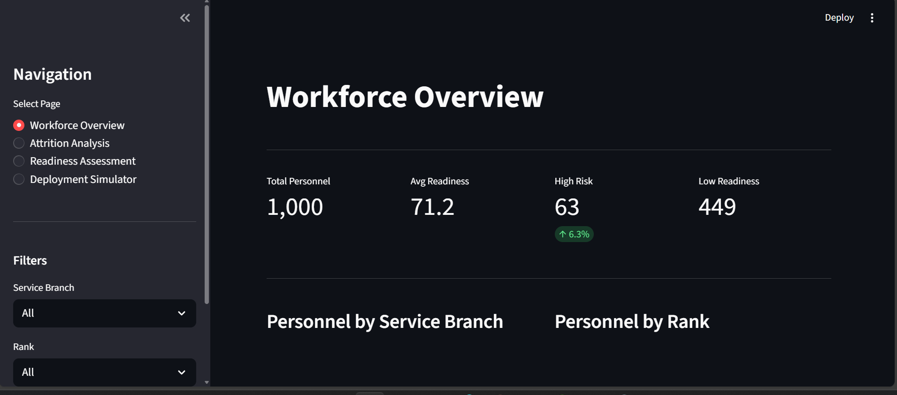
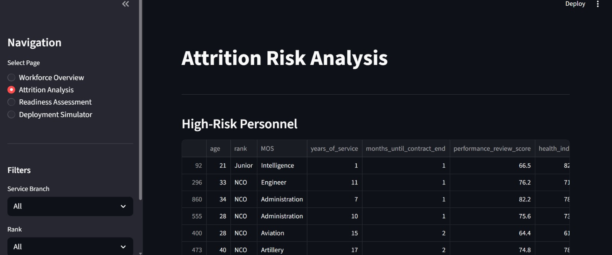

# Military HR Analytics - Personnel Deployment & Attrition Risk System


## Project Overview

Military organizations face unique HR challenges: high training costs, specialized skill requirements, deployment readiness demands, and retention of experienced personnel. This project builds a data-driven system to help commanders answer:

- Which personnel are at risk of leaving before contract completion?
- What is the predicted readiness level of units for potential deployments?
- How do training investments, health status, and leave patterns affect retention?
- What deployment scenarios optimize force readiness while minimizing attrition?

---

## Dashboard Screenshots

**Workforce Overview**



**Attrition Risk Analysis**



**Branch and Rank Breakdown**


**Readiness Assessment**


**Deployment Simulator**


---

## Dataset

- **Personnel records:** 1,000 active service members
- **Time period:** 5 years of historical records (2019-2024)
- **Service branches:** Army (60%), Navy (20%), Air Force (20%)
- **Rank distribution:** Junior (50%), NCO (35%), Officer (15%)
- **Features:** 100 variables across demographics, training, health, deployment, performance, and personal factors
- **Note:** All data is synthetically generated. No real military personnel data was used.

---

## Models

### Attrition Risk Classification

Predicts whether personnel are HIGH_RISK, MEDIUM_RISK, or LOW_RISK of leaving within 12 months.

| Metric | Result |
|--------|--------|
| Best Model | XGBoost |
| Recall (HIGH_RISK) | 0.69 |
| Precision (HIGH_RISK) | 0.53 |
| F1-Score (weighted) | 0.81 |
| Training Samples | 1,308 (after SMOTE) |
| Test Samples | 200 |
| Features Used | 100 |

**Top 5 Attrition Predictors:**

| Feature | Importance |
|---------|------------|
| retention_risk_composite | 0.110 |
| months_until_contract_end | 0.075 |
| contract_pressure | 0.049 |
| mos_retention_rate | 0.046 |
| civilian_job_offers | 0.032 |

### Readiness Score Regression

Predicts individual readiness scores (0-100 scale) for deployment planning.

| Metric | Result |
|--------|--------|
| Best Model | Linear Regression |
| RMSE | 5.45 points |
| R² Score | 0.656 |
| MAE | 4.35 points |
| MAPE | 6.20% |
| Training Samples | 800 |
| Test Samples | 200 |
| Features Used | 98 |

---

## Key Findings

- **Contract pressure** is the strongest attrition predictor - personnel within 12 months of contract end are significantly more likely to leave
- **Civilian job offers** rank among the top 6 predictors, highlighting the importance of competitive retention packages
- **Readiness** is best predicted by training scores, health index, and deployment recency
- **Average readiness score** across the force is 71.2, with 44.9% of personnel below the 70-point threshold
- **6.3% of personnel** fall into the HIGH_RISK attrition category requiring immediate retention intervention

---

## Project Structure

```
Ghana-Armed-Forces-Personnel-Deployment-and-Attrition-Risk-Modeling/
├── dashboard/
│   ├── app.py                          # Streamlit dashboard
│   └── images/                         # Dashboard screenshots
├── data/
│   ├── raw/                            # Generated raw data
│   └── processed/                      # Engineered features
├── models/
│   ├── attrition_classifier.pkl        # Trained XGBoost classifier
│   ├── readiness_regressor.pkl         # Trained regression model
│   └── readiness_scaler.pkl            # Feature scaler
├── reports/
│   ├── figures/                        # All visualizations
│   ├── attrition_feature_importance.csv
│   ├── attrition_model_metrics.csv
│   └── readiness_model_metrics.csv
├── 01_data_generation.ipynb            # Synthetic data generation
├── 02_eda.ipynb                        # Exploratory data analysis
├── 03_feature_engineering.ipynb        # Feature engineering (100 features)
├── 04_attrition_modeling.ipynb         # Classification models
├── 05_readiness_modeling.ipynb         # Regression models
├── 06_deployment_simulation.ipynb      # Simulator demo
├── config.py                           # Project configuration
├── deployment_simulator.py             # DeploymentSimulator class
├── Dockerfile                          # Docker container config
├── docker-compose.yml                  # Docker compose config
├── requirements.txt                    # Python dependencies
└── README.md
```

---

## Installation & Usage

### Option 1: Docker (Recommended)

```bash
# Clone the repository
git clone https://github.com/yourusername/Ghana-Armed-Forces-Personnel-Deployment-and-Attrition-Risk-Modeling.git
cd Ghana-Armed-Forces-Personnel-Deployment-and-Attrition-Risk-Modeling

# Build and run
docker-compose up

# Open browser
http://localhost:8501
```

### Option 2: Local Setup

```bash
# Clone the repository
git clone https://github.com/yourusername/Ghana-Armed-Forces-Personnel-Deployment-and-Attrition-Risk-Modeling.git
cd Ghana-Armed-Forces-Personnel-Deployment-and-Attrition-Risk-Modeling

# Create environment
conda create -n hr_env python=3.10
conda activate hr_env

# Install dependencies
pip install -r requirements.txt

# Run notebooks in order (01 through 05) to generate data and models
# Then launch dashboard
streamlit run dashboard/app.py
```

---

## Deployment Simulator

The deployment simulator allows commanders to run "what-if" scenarios:

```python
from deployment_simulator import DeploymentSimulator

simulator = DeploymentSimulator(
    data_path='data/processed/features_engineered.csv',
    attrition_model_path='models/attrition_classifier.pkl',
    readiness_model_path='models/readiness_regressor.pkl',
    readiness_scaler_path='models/readiness_scaler.pkl'
)

results = simulator.simulate_deployment(
    n_personnel=50,
    duration_months=6,
    min_readiness=80,
    mos_requirements=['Infantry', 'Medical', 'Logistics'],
    allow_high_risk=False,
    strategy='balanced'
)
```

**Strategies:**
- `readiness` - Prioritizes highest readiness scores
- `low_risk` - Prioritizes lowest attrition probability
- `balanced` - Composite score of readiness and retention risk

---

---

*This project uses entirely synthetic data generated for portfolio demonstration purposes. It does not represent actual Ghana Armed Forces personnel, operations, or data systems.*
